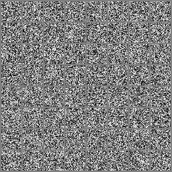
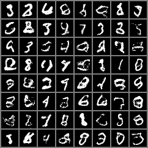
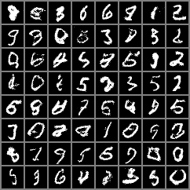
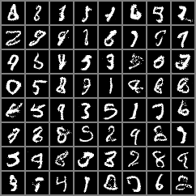
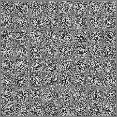
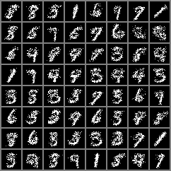
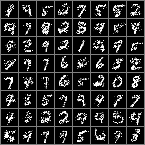
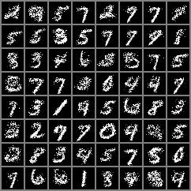
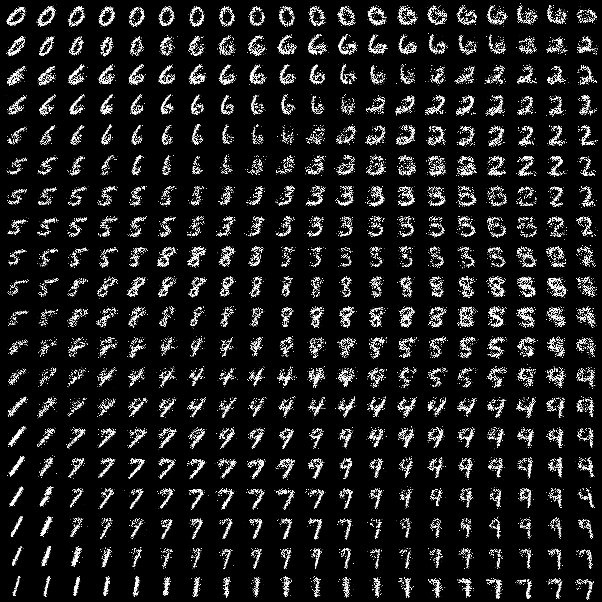

# Variational Autoencoder

Train a VAE model on generating 4-bit MNIST images.

The code is structured in the following way:
* `fmnist.py`: preparing the discretized dataset and providing a data loader for training, validation and testing.
* `cnn_encoder_decoder.py`: Encoder and Decoder based on an CNN.
* `train_pl.py`: training functionalities 
* `utils.py`: reparameterization trick, the KL divergence, bpd calculation and manifold generation.

## Samples

Sample images generated by the VAE model:

Epoch: 0

Epoch: 20

Epoch: 50

Epoch: 80

## Manifolds

Manifold images generated by the VAE model:

Epoch: 0

Epoch: 10

Epoch: 50

Epoch: 80

Manifold:

